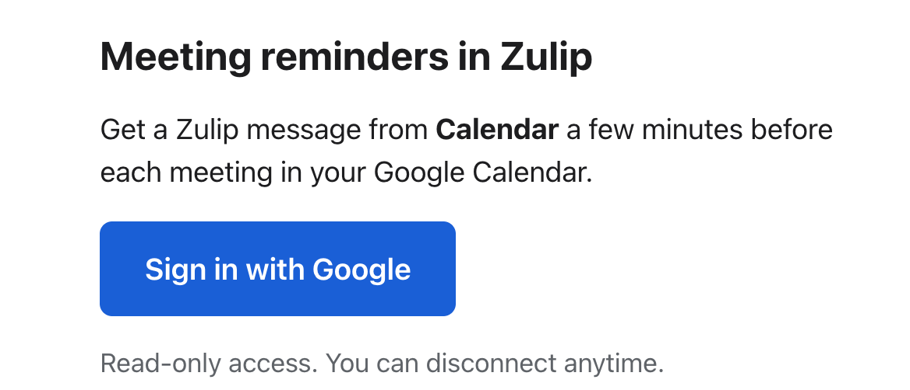
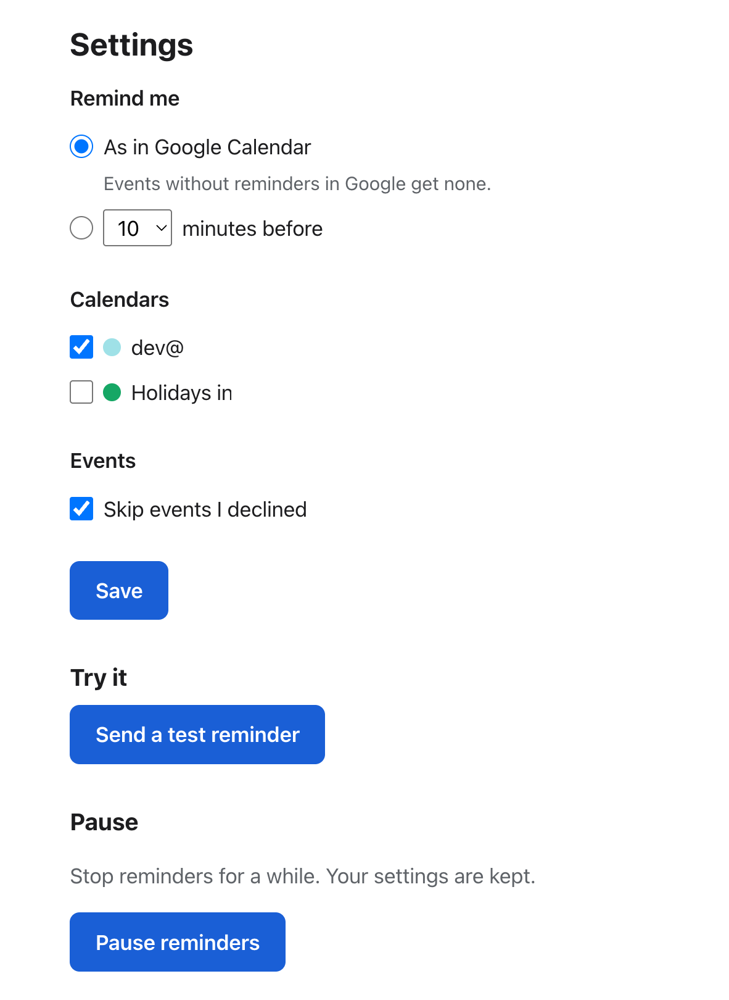

# zulip-gcal-service

Google Calendar meeting reminders in Zulip — for every user, with no scripts.

Zulip's stock Google Calendar integration asks each user to install Python,
download credential files and keep a terminal running. This is a small
self-hosted web service instead: users click **Sign in with Google** once and
get a Zulip DM before each meeting.

* One Go binary + SQLite, shipped as a Docker image; deploy with
  docker-compose / Portainer behind your TLS proxy.
* Read-only calendar access; refresh tokens encrypted at rest.
* Reminder times follow the event's own Google reminders (or a lead time the
  user picks); times render in each reader's timezone.

  
  

## Quick start

1. Admin, once (~15 min): create a Google OAuth client and a Zulip bot, then
   run the Docker image — step by step in
   [docs/admin-setup.md](docs/admin-setup.md).
2. Announce it to your users with the ready-to-paste text in
   [docs/user-guide.md](docs/user-guide.md).

Design and internals: [docs/design.md](docs/design.md).

## Privacy

Calendar access is read-only (`calendar.readonly`). Everything lives in one
SQLite file in `DATA_DIR` on your server; nothing is sent anywhere except
Google (to read calendars) and your Zulip server (to send DMs).

**What is stored, per user**

* Google account id (`sub`) and Google e-mail address.
* The Google refresh token, AES-256-GCM encrypted with a key derived from
  `APP_SECRET`. Access tokens are kept in memory only.
* The linked Zulip user id.
* Settings: timing, lead minutes, skip declined, paused, the ids of the
  watched calendars.
* Upcoming reminders for meetings in the next 26 hours: event id (iCalUID),
  title, start and end time, location, video link and Google Calendar link.
* Reminder history: rows that were sent, expired or skipped, with the same
  meeting details plus the Zulip message id, deleted 7 days after they last
  changed.
* While linking by code: the 6-character code, deleted after 15 minutes or
  when used.

Not tied to any user: ids of handled bot DMs (kept 7 days, so a message is
never run twice) and, after a disconnect, the Google `sub` alone for 1 hour
(so a stale sign-in cannot bring the account back).

**Never stored:** meeting descriptions, attendee lists, events beyond 26
hours, calendars the user does not watch, the content of DMs sent to the bot.
The bot's `today` command reads the calendar live and stores nothing.

**Never logged:** tokens, e-mail addresses, meeting titles or any other event
content, DM content. Logs carry random account ids, message ids and error
kinds.

**How to delete:** click **Disconnect** on the page, or DM the Calendar bot
`disconnect`. One write deletes the account and everything above that belongs
to it, refresh token included, then the service revokes its Google access.
Zulip DMs already sent stay in Zulip. `stop` (or **Pause**) only pauses
reminders and keeps the data.

License: MIT.
